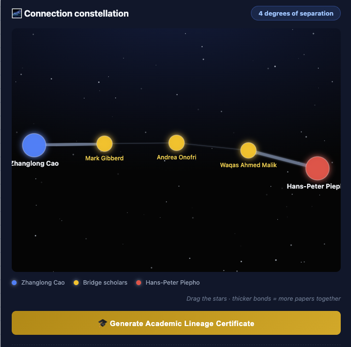
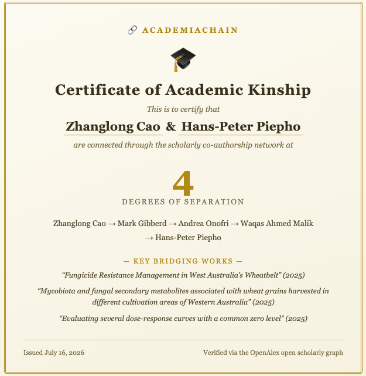

# 🔗 AcademiaChain

**Find the shortest co-authorship path between any two scholars — your Erdős number, generalized.**

Type in two researchers' names and AcademiaChain traverses the [OpenAlex](https://openalex.org)
open scholarly graph with a **bidirectional breadth-first search**, streaming live progress to
your browser and returning the chain of scholars and the bridging papers (title, year, DOI) that
connect them. Celebrate a match by generating a shareable **Academic Lineage Certificate** poster.

<p align="center">
  
</p>
<p align="center">
  <em>A 4-degree connection constellation. Drag the stars; bonds grow thicker and brighter the more papers two scholars share.</em>
</p>

## 🧠 Algorithmic Core & Mathematical Model

At its heart, **AcademiaChain** solves a constrained shortest-path problem on a giant, dynamic academic graph $G = (V, E)$, where:

* **Nodes ($V$):** the set of all scholars (authors) indexed by OpenAlex ($|V| \approx 10^8$);
* **Edges ($E$):** the co-authorship relationships established by co-publishing works.

### 1. Mathematical Formulation

We define the connection between two scholars as a path through a series of joint papers. Let $A_{start}$ and $A_{end}$ denote the source and target authors. A path of $k$ degrees of separation (corresponding to $k+1$ nodes and $k$ edges) is written as:

$$P = (v_0, e_1, v_1, e_2, v_2, \dots, e_k, v_k)$$

where:

* $v_0 = A_{start}$ and $v_k = A_{end}$;
* each node $v_i \in V$ represents a unique OpenAlex author ID;
* each edge $e_i = (v_{i-1}, v_i) \in E$ is realized by at least one collaborative work $W_i$;
* the **edge weight** $W(e_i)$ captures the collaborative intensity — the number of co-authored papers between $v_{i-1}$ and $v_i$:

$$W(e_i) = \left|\, \{ w \in \text{Works} \mid \{v_{i-1}, v_i\} \subseteq \text{authors}(w) \} \,\right|$$

The objective is to find the path $P$ minimizing the degrees of separation (path length $k$), subject to a hard depth constraint:

$$\min_{P} \; k(P) \quad \text{s.t.} \quad k \le \text{MAX\_DEPTH}$$

The frontend renders $W(e_i)$ directly: aggregated links grow thicker and brighter with each additional shared paper, so high-intensity partnerships are visually salient in the constellation graph.

### 2. Search Logic: Bidirectional BFS with Strict Pruning

A standard single-source BFS suffers from exponential complexity $O(b^d)$, where $b$ is the average branching factor (often $> 100$ co-authors) and $d$ is the search depth. To prevent API timeouts and memory explosion, AcademiaChain implements:

* **Bidirectional search (meet-in-the-middle):** two simultaneous BFS frontiers — forward $Q_F$ from $A_{start}$ and backward $Q_B$ from $A_{end}$ — expanding the smaller frontier at each round. The search terminates the moment the forward and backward visited sets intersect:

$$V_{visited,F} \cap V_{visited,B} \neq \emptyset$$

  This reduces the complexity from $O(b^d)$ to $O(b^{d/2})$, converting a 10-second timeout into a sub-second collision.

* **Degree pruning & noise filtering:**
  * *Temporal filtering* — only the $N$ most recent works of any author are queried, capturing **active** collaboration:

$$\text{Works}(v) = \text{Top}_{20}\left( \{ w \in \text{Works} \mid v \in \text{authors}(w) \} \;\text{sorted by date desc} \right)$$

  * *Hyper-authorship exclusion* — large consortium papers (e.g., global clinical trials, particle-physics collaborations) act as low-affinity noise and are skipped outright:

$$\text{Filter out } w \quad \text{if} \quad |\text{authors}(w)| > 15$$

* **Local in-memory deduplication:** a cache of resolved nodes lets each BFS round bypass previously traversed scholars:

$$\text{Next\_Frontier} = \bigcup_{v \in \text{Frontier}} \text{Collaborators}(v) \setminus V_{visited}$$

### 📈 Parameter Matrix (The Golden Ratio)

| Parameter | Value | Mathematical / Logical Impact |
| :--- | :--- | :--- |
| `MAX_DEPTH` | `4` | Maximum degrees of separation ($k \le 4$). Matches the "small world" boundary of academic networks. |
| `WORKS_PER_AUTHOR` | `20` | Limits the cardinality of $\text{Works}(v)$ to 20. Prevents deep historical pagination. |
| `MAX_AUTHORS_PER_WORK` | `15` | Filters out works where $\vert\text{authors}(w)\vert > 15$. Eliminates global consortium noise. |
| `FRONTIER_CAP` | `12` | Restricts the per-round frontier expansion to 12 nodes, preventing width explosion. |

## ✨ Features

- **Bidirectional BFS** over the live OpenAlex co-authorship graph — no pre-built database.
- **Interactive constellation graph (D3.js)** — glowing force-directed nodes on a starfield
  canvas; edges aggregate repeated collaborations and grow thicker and brighter with every
  shared paper, so the strongest partnerships stand out at a glance.
- **Real-time progress streaming (SSE)** — watch each search level unfold in a status timeline.
- **Autocomplete with identity lock-in** — a debounced dropdown shows name, affiliation, and
  works count; picking a suggestion pins the exact OpenAlex author ID, so prolific names
  ("academic big shots") are never mis-resolved.
- **Smart author disambiguation** — free-text fallback scores candidates by normalized
  name-token match (Unicode hyphens and diacritics folded), not just API rank.
- **Advanced disambiguation search** — when the popularity-ranked autocomplete misses a
  scholar, a full-index modal search (optionally scoped by institution keyword) surfaces
  candidate cards with affiliation, country, works/citation counts, and research-field tags.
- **Rate-limit friendly** — concurrency limiter, batch pacing, automatic retry with backoff on HTTP 429.
- **In-memory caching** — co-author lookups are cached across warm serverless invocations.
- **Certificate poster** — one click renders a share-ready PNG via html2canvas.
- **Credentials Center** — bring your own OpenAlex API key (1M calls/day) or academic email
  (100k polite-pool calls/day); saved in your browser's localStorage and applied to every
  API call, taking priority over the server's default credentials.

<p align="center">
  
</p>
<p align="center">
  <em>One click turns a discovered path into a share-ready Certificate of Academic Kinship.</em>
</p>

## 🔒 Privacy & Compliance

This project is built with privacy-first and open-science principles in mind:

- **100% Public Data:** All author profiles, institutional affiliations, and co-authorship
  links are fetched directly from **OpenAlex**, which indexes publicly available, published
  academic metadata. No private or non-academic data is accessed.
- **No Database / Zero Logs:** We do not host any databases. Your search queries, locked IDs,
  and results are processed in-memory via serverless functions and are never stored or logged.
- **Client-Side Key Safety:** Any personal API keys or academic emails you configure are
  stored strictly in your browser's local storage (`localStorage`). They are relayed
  in-memory to the OpenAlex API for the duration of a request and are never visible to the
  project maintainers.

## 🚀 Run locally

```bash
npm install
# edit .env.local and set OPENALEX_MAIL=you@example.com
# (joins the OpenAlex "polite pool" for faster, more reliable responses)
npm run dev
# open http://localhost:3000
```

## ☁️ Deploy to Netlify (free)

1. Push this repository to GitHub.
2. In Netlify choose **Add new site → Import an existing project** and pick the repo.
   The included `netlify.toml` configures the official Next.js runtime — the API route is
   packaged as a serverless function automatically; no build settings to change.
3. Under **Site configuration → Environment variables** add:
   - `OPENALEX_MAIL = you@example.com` — default polite-pool email
   - `OPENALEX_API_KEY = …` *(optional)* — default API key, used when a visitor hasn't
     configured their own credentials in the Credentials Center
4. Deploy.

## 🧠 How it works

| File | Role |
|---|---|
| `src/app/api/search/route.js` | Serverless backend: author resolution + bidirectional BFS, streamed as Server-Sent Events |
| `src/app/api/autocomplete/authors/route.js` | Author autocomplete proxy with hyphen-variant retry and canonical-record re-ranking |
| `src/app/page.js` | Frontend: autocomplete inputs, live progress timeline, path visualization, certificate poster |

OpenAlex has no "co-authors" endpoint, so expanding a node means fetching that author's
top-cited works (`/works?filter=author.id:X`) and extracting co-authors from `authorships`.

### Performance guards (tunable constants at the top of `route.js`)

Netlify's free tier enforces a hard 10-second function timeout, so the search is defensive.
The pruning parameters are formalized in the
[Algorithmic Core](#-algorithmic-core--mathematical-model) section above; operationally:

- **Time budget** (default 8.5s, override with `SEARCH_TIME_BUDGET_MS`) — every fetch carries an
  abort signal tied to the remaining budget, and the search exits gracefully on exhaustion.
- **Rate-limit safety** — a concurrency semaphore, inter-batch pacing, and automatic backoff
  retry on HTTP 429 keep the crawler inside OpenAlex's polite-pool limits.
- **Hub-first expansion** — frequent collaborators (more shared papers) are expanded first.
- **In-memory caching** — co-author lookups persist across warm invocations, so repeat and
  nearby searches get faster.

Because only each author's recent, small-team works are sampled, the reported path is the
shortest **within the sampled network** — it favors active, genuine collaborations and can
exceed (or miss) the true minimum for historical or mega-collaboration links.

Data: [OpenAlex](https://openalex.org) — free, open, no API key required.
